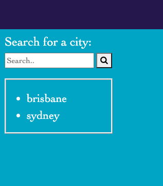
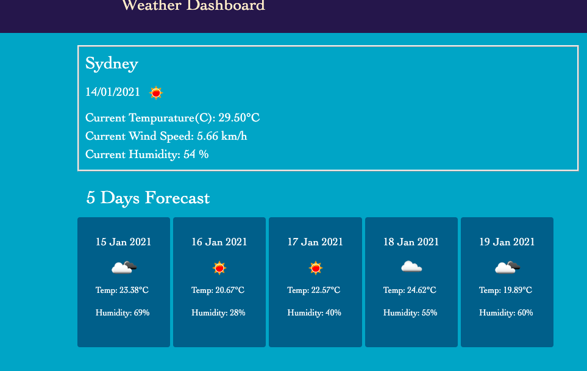
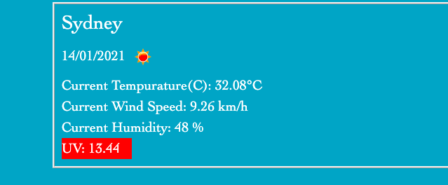

# WeatherForecast_Yourcity
This is my BCS Homework from Week6

# Assignment Criteria
 
* WHEN I search for a city

 

* THEN I am presented with current and future conditions for that city and that city is added to the search history

* WHEN I view current weather conditions for that city
* THEN I am presented with the city name, the date, an icon representation of weather conditions, the temperature, the humidity, the wind speed, and the UV index
* THEN I am presented with a 5-day forecast that displays the date, an icon representation of weather conditions, the temperature, and the humidity

* WHEN I view the UV index
* THEN I am presented with a color that indicates whether the conditions are favorable,    moderate, or severe

# What I learned from this assignment
* Using API multiple way, it was very interesting and exciting assignment.
Started looking at all the apps and website differently now.
Hopefully I get more practice and used to it.